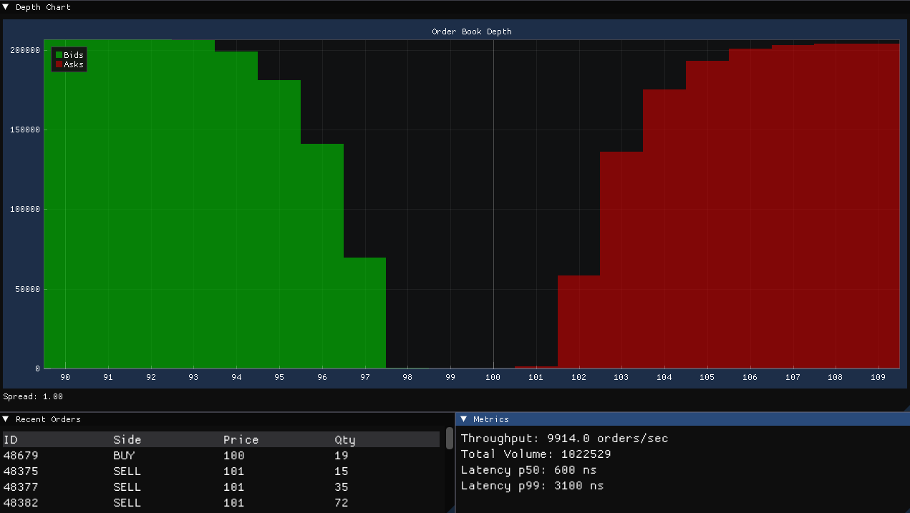

# Low Latency Order-Book 

This project consists of a low latency order book and real time Gui that contains an order depth chart,
list of recent orders, and metrics concerning matching engine performance. A custom order generator is used
to create orders. 

## Architecture

The order generator, backend, and Gui all operate on their own thread with SPSC ring buffers connecting them 
in the sequence: Order generator -> Backend -> Gui. Dear ImGui and ImPlot are used for the Gui. The order matching 
logic works by walking through opposing orders (by price - time priority) until the current order is either
fufilled or has leftover quantity, at which point its appended to the appropriate price level.
A fixed size memory pool is used, with orders held in an intrusive doubly linked list for each existing price level.

## Performance

Performance under different load, reference price set to 100 with a stddev of 2.5:

| Orders/sec | P50 Latency (ns) | P99 Latency (ns)* |
|------------|------------------|-------------------|
| 100        | 1600-1800        | 7400              |
| 1000       | 800-1000         | 3500              |
| 5000       | 600-800          | 3800              |
| 10000      | 600-700          | 3200              |

*Note: Values for P99 were lowest observed, however the values varied signifigantly
likely due to the method by which its calculated.

## Build Instructions
GLFW, ImGui and ImPlot are all dependencies

To compile build, run:

```bash
mkdir build
cd build
cmake .. -G "MinGW Makefiles"
cmake --build .
```

# Screenshot

